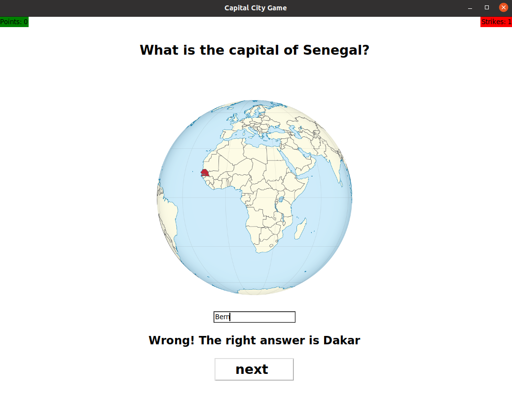
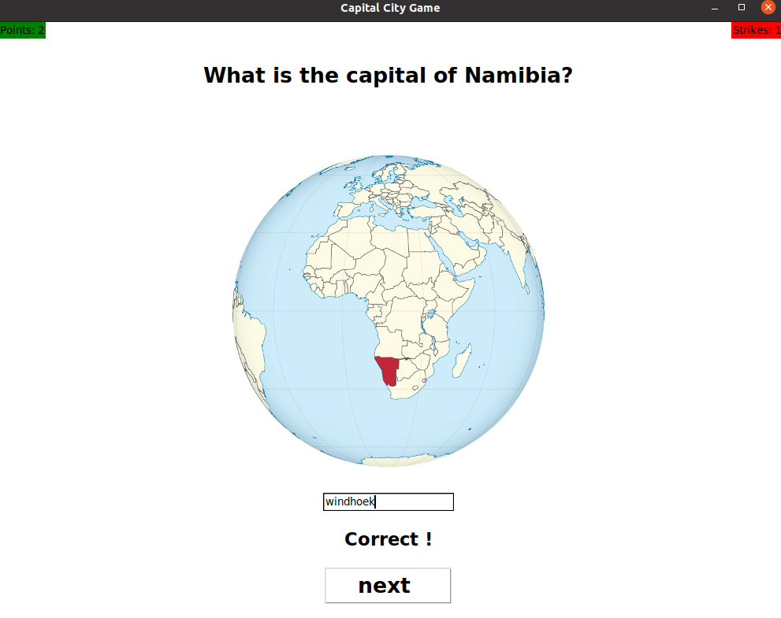
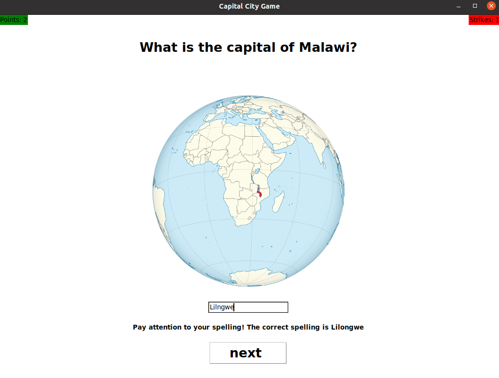

# Capital-City-Quiz
This repository contains a game about the capitals of Africa and Asia.  
It is designed to help the user learn the capitals. For didactic reasons, no multiple choice answers are provided, but the user must type in (case insensitive) the capital of the displayed country.Thus, he also learns to write the names of the cities correctly.

## Rules
The user must enter a user name. Then he is repeatedly asked about the capital of a country from the database. The country is drawn randomly from the database. In the upper left corner of the interface, the player  can see his score. There

  

 is one point per correct answer. In the upper right corner the player can see his strikes. There is also one strike per wrong answer.The game is over when the player has 3 strikes. At the end, a ranking of the points is displayed.  
On the screenshot below you can see how it looks like, when you give a correct answer.

  

Here on the screenshot below you can see how it looks like, when you give a wrong answer. As one can see in this case the correct answer immediately displayed.

  

## Features
We implemented a mechanism to detect spelling errors. Thus, our program can distinguish whether the user just misspelled the capital or did not answer correctly. On the picture below one can see an example of how this looks like.

  

   
  
    
    

Let `sol := corret answer` and let `word := answer provided by user`, then `word` is conidered as misspelled if  
`Levenshteindistance(sol, word) > 0 and Levenshteindistance(sol, word) <= len(sol)` where `len(sol)`is the number of characters in `sol`.

