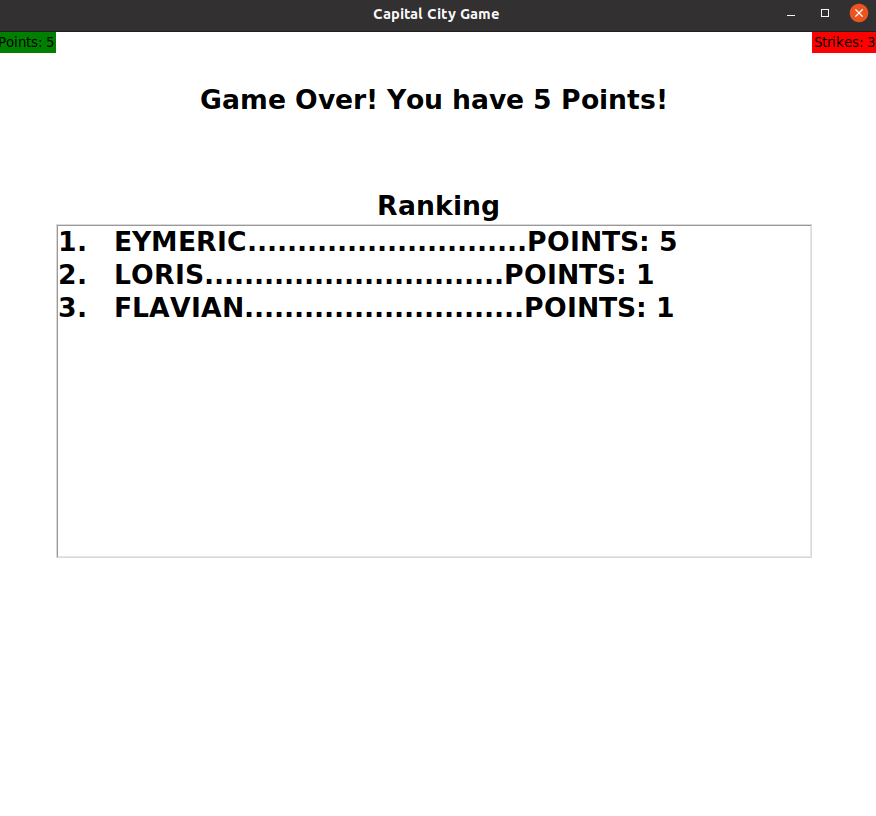

# Capital-City-Quiz
This repository contains a game about the capitals of Africa and Asia.  
It is designed to help the user learn the capitals interactively. For didactic reasons, no multiple choice answers are provided, but the user must type in (case insensitive) the capital of the displayed country.Thus, he also learns to write the names of the cities correctly.  
The Graphical User Interface is implemented using the `tkinter` package https://docs.python.org/3/library/tkinter.html which is the standard Python interface, the beautiful `JSON` format was used for the implementation of the databases https://www.json.org/json-en.html.   
Everything used in this repository is standard Python which makes it easy to build and recompile this program on your one machine.

## Setup
The only requirements are `Python 3` you can downloaded it for free [here](https://www.python.org/downloads/).
1. Clone the repo via HTTPS:  
`$ git clone https://github.com/Lorismayr/Capital-City-Quiz.git`  
2. Run the `capitalcity.py` file as `Python3` in your favorite Editor/IDE.
3. Have Fun !

## Rules
The user must enter a user name. Then he is repeatedly asked about the capital of a country from the database. The country is drawn randomly from the database. In the upper left corner of the interface, the player  can see his score. There is one point per correct answer. In the upper right corner the player can see his strikes. There is also one strike per wrong answer.The game is over when the player has 3 strikes. At the end, a ranking of the points is displayed.  
On the screenshot below you can see how it looks like, when you give a correct answer.

  

Here on the screenshot below you can see how it looks like, when you give a wrong answer. As one can see in this case the correct answer is immediately displayed.

  

And finally on the screenshot below one can see how it looks like at the end of the game when the ranking is displayed.

  

## Features
We implemented a mechanism to detect spelling errors. Thus, our program can distinguish whether the user just misspelled the capital or did not answer correctly. On the picture below one can see an example of how this looks like.

  

   
  
    
    

The algorithm is implemented using dynamic programming in O(mn). For further details please take a look at https://en.wikipedia.org/wiki/Levenshtein_distance  
Let `sol := corret answer` and let `word := answer provided by user`, then `word` is conidered as misspelled if  
`Levenshteindistance(sol, word) > 0 and Levenshteindistance(sol, word) <= len(sol)` where `len(sol)`is the number of characters in `sol`.  

## Structure
This repository contains the following files:  
1. `capitalcity.py`  
  * contains the main functionality of the game, for further documentarion please look at the comments in the code. 
2. `countrymodule.py`
  * contains the country class
3. `playermodule.py`
  * contains the player class
4. `data.json`
  * contains the database of the countries, the capitals, alternative spellings and the pictures
5. `players.json`
  * contains the database of the players, used for the ranking

The `Pictures` folder contains all the pictures used in the game. All the Pictures of the Countries are taken from Wikipedia.

## Contributers
* Loris Mayr
* Flavian Neggri
* Eymeric Zougs

